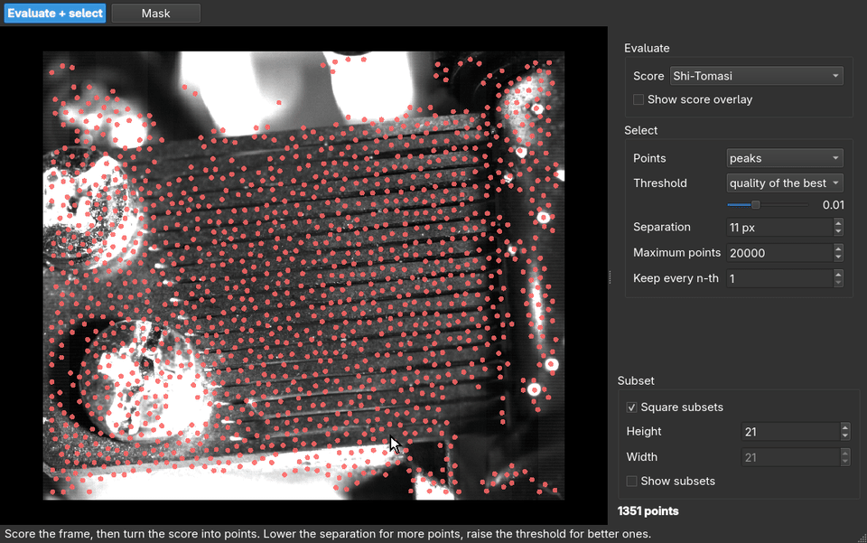

[](https://pyidi.readthedocs.io/en/latest/?badge=latest)


# pyIDI

**Image-based Displacement Identification (IDI)** from high-speed video, in Python.

pyIDI reads a recording, tracks the points you select, and returns their sub-pixel
displacement history — ready for modal analysis.

📖 [**Documentation**](https://pyidi.readthedocs.io/en/latest/index.html)

## Installation

```bash
pip install pyidi          # identification
pip install pyidi[qt]      # + the point-selection and result-viewing GUIs
```

Python >= 3.10.

## Quick start

```python
from pyidi import VideoReader, LucasKanade

video = VideoReader('measurement.cih')

lk = LucasKanade(video)
lk.set_points(points=[[150, 200], [150, 260], [150, 320]])   # (row, column)
lk.configure(roi_size=(21, 21))

displacements = lk.get_displacements()   # (n_points, n_frames, 2), in pixels
```

`VideoReader` handles Photron `.cih`/`.cihx`, Phantom `.cine`, Pharsighted `.SLOW`,
image sequences, ordinary video files (MP4, AVI, MOV, ...), and `numpy.ndarray`
stacks of shape `(n_time_points, image_height, image_width)`.

Points are set on the **method** object, not on the `VideoReader`.

### Selecting points interactively

```python
from pyidi import SelectionGUI

gui = SelectionGUI(video, subset_size=21)
lk.set_points(gui)
```

`SelectionGUI` scores every position in the frame and picks the
best-separated features inside the region you draw, so it finds the points
rather than filtering a grid you placed. Draw with a polygon, a brush, a
polyline or single clicks; set a region's role to `points` and it lays them
out without scoring. Vertex dragging and undo throughout. See the
[documentation](https://pyidi.readthedocs.io/en/latest/quick_start/feature_selection.html).

The window `SelectionGUI` named in 1.3 is now `SelectionGUIOld` — deprecated,
and removed in 1.5. It takes the same arguments and returns the same points,
so scripts carry over unchanged.



### Or drive everything from the napari UI

```python
from pyidi import VideoReader, GUI

video = VideoReader('data/data_synthetic.cih')
gui = GUI(video)

displacements = gui.method.displacements
```


## Example dataset

No recording of your own yet? A high-speed video of a vibrating music-box comb is
published on Zenodo ([10.5281/zenodo.22105821](https://doi.org/10.5281/zenodo.22105821),
CC BY 4.0) and loads directly from `pyidi`. Only the frames you ask for are downloaded,
and they are cached in `~/.pyidi/datasets` (or in `PYIDI_DATA_DIR`), so only the first
call is slow:

```python
import pyidi

# 600 frames of 640x552 px, 16-bit: 404 MiB on the first call
video = pyidi.datasets.load_music_box()

lk = pyidi.LucasKanade(video)
lk.set_points([[109, 500], [175, 500], [329, 500]])   # three teeth of the comb
lk.configure(roi_size=(21, 51))                       # a region one tooth tall
displacements = lk.get_displacements()
```

The comb was recorded with a Photron FASTCAM SA-Z at 7500 fps. Its teeth are cantilevers
of graduated length, so each rings at its own natural frequencies, with sub-pixel
amplitudes on a naturally speckled surface — a convenient benchmark for displacement
identification. The identified frequencies land within a few cents of equal-tempered
pitches across nearly two octaves:


Datasets are a registry, so this one is loaded like any other:
`pyidi.datasets.list_datasets()` says what is available,
`pyidi.datasets.load_dataset('music_box')` loads it, and
`pyidi.datasets.register_dataset()` accepts a recording of your own published the same
way — a Zenodo record with a Photron `cihx` header next to an uncompressed `mraw` file.

The full example is in [`examples/Showcase_music_box.ipynb`](examples/Showcase_music_box.ipynb):
from the raw video to the notes of the comb and to the operating deflection shape of a
single tooth. If you use the dataset, please cite it:

- Stanovnik, G., & Slavič, J. (2026). **High-speed video of a vibrating music-box comb
  (Photron FASTCAM SA-Z, 7500 fps, 640x552 px)** [Data set]. Zenodo.
  https://doi.org/10.5281/zenodo.22105821

## Methods

| Method | Solves for | Use it when |
| --- | --- | --- |
| `SimplifiedOpticalFlow` | 2 translations, from the image gradient | a fast first look, motion well below a pixel |
| `LucasKanade` | 2 translations, iteratively | the default choice |
| `DirectionalLucasKanade` | 1 translation along a known direction | motion along a known axis; edge-like features |
| `DIC` | 6 (affine) or 3 (rigid) warp parameters | strain and in-plane rotation, not just translation |

The Lucas-Kanade inner loop is compiled with `numba` and parallelized over points —
one to two orders of magnitude faster than the NumPy implementation.

## Pre-test motion visualization

Eulerian video magnification amplifies subtle, sub-pixel motion directly in the raw
recording, before any identification is run — useful for checking whether and where
a structure moves, and for isolating a single mode:

```python
from pyidi.postprocessing import EulerianMagnifier

evm = EulerianMagnifier(video)
evm.configure(freq_band=(45.0, 55.0), amplification=25)
evm.save('mode_50Hz', output_format='mp4')
```

This is qualitative visualization, **not** a measurement.

## Upgrading

Version 1.0 replaced the monolithic `pyIDI` class with a `VideoReader` plus a
separate method class, so that autocompletion and inline documentation work
properly in VSCode, PyCharm and similar editors. Later releases removed the old
`SubsetSelection` widget and changed how untrackable points are reported.

See the [upgrading guide](https://pyidi.readthedocs.io/en/latest/migration.html)
for what to change. The legacy class is still importable
(`from pyidi import pyIDI`) for compatibility, but is not being developed.

## Developer guidelines

* Add `pyidi/methods/_name_of_method.py` with a class that inherits from `IDIMethod`.
* The class must implement:
  * `configure()` — every parameter stored as a class attribute of the same name
    (this is what makes settings reproducible, picklable and exportable to JSON);
  * `calculate_displacements()` — sets `self.displacements`, of shape
    `(n_points, n_frames, 2)`.
* Export the new class in `pyidi/methods/__init__.py`.

## Citing

If you are using `pyIDI` for your research, consider citing our articles:

- Masmeijer, T., Habtour, E., Zaletelj, K., & Slavič, J. (2024). **Directional DIC method with automatic feature selection**. Mechanical Systems and Signal Processing, 224. https://doi.org/10.1016/j.ymssp.2024.112080
- Čufar, K., Slavič, J., & Boltežar, M. (2024). **Mode-shape magnification in high-speed camera measurements**. Mechanical Systems and Signal Processing, 213, 111336. https://doi.org/10.1016/J.YMSSP.2024.111336
- Zaletelj, K., Gorjup, D., Slavič, J., & Boltežar, M. (2023). **Multi-level curvature-based parametrization and model updating using a 3D full-field response**. Mechanical Systems and Signal Processing, 187, 109927. https://doi.org/10.1016/j.ymssp.2022.109927
- Zaletelj, K., Slavič, J., & Boltežar, M. (2022). **Full-field DIC-based model updating for localized parameter identification**. Mechanical Systems and Signal Processing, 164. https://doi.org/10.1016/j.ymssp.2021.108287
- Gorjup, D., Slavič, J., & Boltežar, M. (2019). **Frequency domain triangulation for full-field 3D operating-deflection-shape identification**. Mechanical Systems and Signal Processing, 133. https://doi.org/10.1016/j.ymssp.2019.106287

[](https://doi.org/10.5281/zenodo.4017153)
