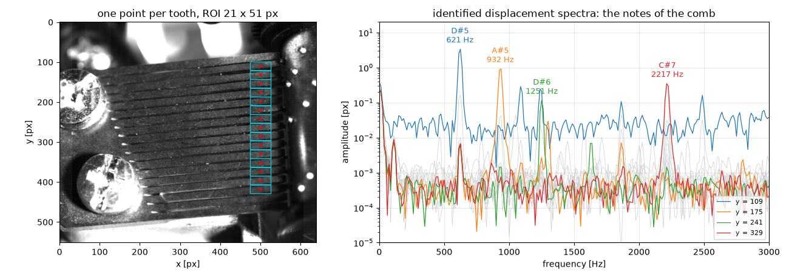

.. _datasets-label:

Example datasets
================

High-speed recordings are large, so the example datasets are not shipped with the
package. They are published on Zenodo and downloaded on first use into
``~/.pyidi/datasets``. The cache directory can be changed with the
``PYIDI_DATA_DIR`` environment variable or with the ``data_dir`` argument.

.. code:: python

    pyidi.datasets.list_datasets()          # {'music_box': 'Vibrating comb of a ...'}
    video = pyidi.datasets.load_dataset('music_box')

Every dataset is loaded the same way, through :func:`pyidi.datasets.load_dataset`;
each one also has a named shortcut, such as :func:`pyidi.datasets.load_music_box`.

Music box
---------

A recording of the vibrating steel comb of a mechanical music box, made with a
Photron FASTCAM SA-Z at 7500 fps, 640 x 552 px, 12-bit
(`10.5281/zenodo.22105821 <https://doi.org/10.5281/zenodo.22105821>`_, CC BY 4.0).
The teeth are cantilevers of graduated length, each ringing at its own natural
frequencies with sub-pixel amplitudes on a naturally speckled surface.

.. code:: python

    import pyidi

    video = pyidi.datasets.load_music_box()

    lk = pyidi.LucasKanade(video)
    lk.set_points([[109, 500], [175, 500], [329, 500]])   # three teeth of the comb
    lk.configure(roi_size=(21, 51))                       # a region one tooth tall
    displacements = lk.get_displacements()

One frame is 0.67 MiB, so the 600 frames of the default window are a 404 MiB
download. The published excerpt holds 3000 frames (0.4 s) and ``n_frames='all'``
downloads it to its end. The excerpt itself is a part of a 36 GiB recording of
55 238 frames, which is in the same Zenodo record and can be downloaded manually
if a longer signal is needed.

The teeth run horizontally across the frame, clamped at the left (the staircase of
slot ends) and free at the right (x ~ 560 px), with a pitch of about 22 px. Points
at ``x = 500`` and a region of interest of one tooth, e.g. ``roi_size=(21, 51)``,
work well: the region is then not confused by the neighbouring teeth and is long
enough horizontally to have plenty of texture.

In the excerpt, one tooth rings from the start and another one is plucked at about
frame 350. The default window (``first_frame=400``) opens after that pluck, where
both teeth ring freely, with amplitudes from 0.03 px to 3 px, and the motion is
smooth enough to be tracked from a single reference image. ``first_frame=0``
includes the pluck itself, where the tooth moves by more than 10 px between
consecutive frames — a much harder case for any local method.

A complete analysis — from the raw video to the notes of the comb and to the
operating deflection shape of a single tooth — is in the
`Showcase_music_box.ipynb <https://github.com/ladisk/pyidi/blob/master/examples/Showcase_music_box.ipynb>`_
example notebook.

If you use the dataset, please cite it:

    Stanovnik, G., & Slavič, J. (2026). *High-speed video of a vibrating music-box
    comb (Photron FASTCAM SA-Z, 7500 fps, 640x552 px)* [Data set]. Zenodo.
    https://doi.org/10.5281/zenodo.22105821

The arguments of the loader are documented with the rest of the source code, see
:mod:`pyidi.datasets`.

Adding a dataset
----------------

A dataset is a dictionary of metadata in the ``pyidi.datasets.DATASETS`` registry,
so adding one needs no new code. The download strategy is shared: a Zenodo record
holding a Photron ``cihx`` header next to an uncompressed ``mraw`` file of
fixed-size frames, which is what lets a window be addressed by byte offset and
fetched with a range request.

.. code:: python

    pyidi.datasets.register_dataset({
        'name': 'my_recording',
        'record': '1234567',            # Zenodo record id
        'header_file': 'my_recording.cihx',
        'data_file': 'my_recording.mraw',
        'header_md5': '...',
        'n_frames_total': 5000,
        'image_height': 512,
        'image_width': 512,
        'bytes_per_pixel': 2,
    })
    video = pyidi.datasets.load_dataset('my_recording')

``register_dataset`` accepts a dataset from anywhere, so a recording that is not
part of pyidi can be loaded through the same functions. A dataset that ships with
pyidi is simply registered in ``pyidi/datasets.py``. The optional keys are ``doi``,
``url``, ``data_md5``, ``fps``, ``license``, ``citation``, ``description``,
``default_first_frame`` and ``default_n_frames``.
