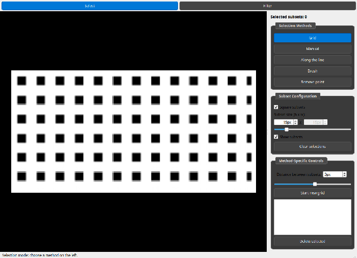

.. _point-selection-old:

Point selection UI (deprecated)
===============================

.. deprecated:: 1.4

    This is the window ``SelectionGUI`` named in 1.3. It is now
    ``SelectionGUIOld``, it is frozen, and it is removed in 1.5.
    :doc:`feature_selection` documents the interface that ``SelectionGUI``
    names today, and constructing this one prints a ``DeprecationWarning``.

    The replacement does everything described on this page. The constructor
    signature is identical and ``get_points()`` returns the same ``(row, col)``
    array, so a script that opens the window and reads its points only needs
    the name changed -- or nothing at all, if it says ``SelectionGUI``.

This page is kept for the 1.4 cycle, so that a script written against the old
window can be read alongside the code it drives.

What does not carry over
------------------------

- ``get_filtered_points()`` and ``get_selected_points()``. The replacement has
  one ``get_points()``: filtering is no longer a second pass over an existing
  selection, it *is* the selection.
- The internal attributes -- ``selections``, ``subset_size_spinbox``,
  ``candidate_points`` and the rest. Nothing in the replacement corresponds to
  them.
- ``Grid`` as a mode. Draw a polygon and set its row to the ``points`` role, or
  keep it a mask and choose the ``lattice`` selector.

Scores near the image border also differ slightly, because the replacement
takes gradients over real neighbours instead of ones reflected at the subset
edge. The new value is the correct one.

Everything below describes ``SelectionGUIOld`` as it behaves today.

Using it
--------

It is a PyQt6-based tool, so the ``[qt]`` extra must be installed first:

.. code:: bash

    pip install pyidi[qt]

Without this extra, ``SelectionGUIOld`` can still be imported, but instantiating
it raises a ``RuntimeError``.

To use the UI, a ``VideoReader`` object must first be created (a plain
``numpy.ndarray`` image also works):

.. code:: python

    from pyidi import VideoReader, SimplifiedOpticalFlow, SelectionGUIOld

    video = VideoReader(input_file)

where ``input_file`` can be a Photron ``.cih``/``.cihx`` path, an image, a
video file, a numpy array, or a ``.SLOW`` file.

A ``SelectionGUIOld`` window can then be opened:

.. code:: python

    gui = SelectionGUIOld(video, subset_size=11, subset_overlap=0)

The window is modal: the call blocks until you close it, and execution
continues on the next line with the selection available on the object.

Here, ``subset_size`` is the side length (in pixels) of the
Region-Of-Interest/subset drawn around each point, and ``subset_overlap``
sets the spacing between neighbouring subsets (the step between subset
centers is ``subset_size + subset_overlap``, so a positive value spreads the
subsets further apart and a negative value overlaps them).

``subset_size`` can be a single int for a square subset, or a ``(height,
width)`` pair for an anisotropic one -- the same ``(vertical, horizontal)``
convention as ``LucasKanade.configure(roi_size=(vertical, horizontal))``. In
the UI, the ``Subset Configuration`` group has a ``Square subsets`` checkbox
(checked by default) alongside the height/width spinboxes and sliders: while
checked, the width tracks the height and only one size can be set; unchecking
it frees the width spinbox/slider to be set independently.

Selection mode
--------------

The window opens in **Select** mode. Five selection methods are available as
buttons on the right:

- **Grid**: click to place the corners of a polygon; once at least three
  corners are placed, a regular grid of subsets is generated inside the
  polygon. ``Start new grid`` starts another grid; each one becomes its own
  row in the selections list, described below.
- **Manual**: click on the image to add individual points one at a time. All
  manually clicked points are collected into a single ``Manual`` row in the
  list.
- **Along the line**: click to place points defining a polyline; subsets are
  placed at regular intervals along its segments. ``Start new line`` starts
  another line; as with ``Grid``, each one becomes its own row in the list.
- **Brush**: hold Ctrl and drag over the image to paint a region; subsets are
  placed on a regular grid inside the painted area. Each stroke becomes its
  own row in the list. The brush radius is set with a slider, and the
  ``Deselect painted area`` toggle switches the brush to remove
  already-selected subsets instead of adding new ones. Deselecting erases only
  the area actually painted over: a stroke keeps whatever part of it was not
  covered, and its row disappears only once nothing is left painted.
- **Remove point**: click near an existing point to remove it. The point
  stays removed even if the subset size or spacing is changed afterwards.

The ``Subset Configuration`` group lets you adjust the subset size, toggle
the subset rectangle overlay (``Show subsets``), and clear the current
selection (``Clear selections``). For ``Grid``, ``Along the line``, and
``Brush``, a ``Distance between subsets`` control sets the spacing described
above.

The selections list
--------------------

Every selection made in any of the modes above — every grid, every line,
every brush stroke, and the single ``Manual`` row — is listed in the
right-hand panel as one always-visible ``selections`` list, regardless of
which mode is currently active. Each row shows the selection's label and its
current point count, e.g. ``Grid 1 — 142 pts``, updated live as the selection
changes.

- **Clicking a row** makes it the active selection, switches the tool to
  match its type so its vertices are immediately draggable, and rings its
  points in the image in magenta. The ring is a Select-mode cue and is hidden
  in Filter mode.
- **Each row has a checkbox.** Unchecking it excludes that selection's points
  from the result without deleting it, so a region can be tried in and out
  without redrawing it.
- **``Delete selected``** deletes the currently selected row, of any type —
  including a single brush stroke or the ``Manual`` row.
- Labels are never reused: deleting ``Grid 2`` and then creating another grid
  gives ``Grid 4``, not a second ``Grid 3``.

Editing a selection
-------------------

Grids and polylines stay editable after they are drawn. Clicking their row
in the selections list also switches to the matching tool, so a grid or line
can be edited without first re-selecting the corresponding button.

**Moving a vertex.** A left-drag that starts within about 10 screen pixels of
an existing vertex moves that vertex; a drag anywhere else pans the view. The
grab radius is constant in screen pixels, so it behaves the same at any zoom.
The subsets are recomputed once, when the drag finishes. Clicking exactly on
an existing vertex does nothing, rather than stacking a duplicate on top of
it.

**Undo (Ctrl+Z)** reverses adding a vertex, moving a vertex, and deleting a
selection — a grid, a polyline, a brush stroke, or the ``Manual`` row. A
restored selection comes back at its original row in the list, with its
original label. Filter results are *not* undoable.

Filter mode
-----------

Switching to **Filter** mode (top toolbar) applies automatic filtering on top
of the subsets placed in Select mode, to keep only the ones on
strongly-textured image content. Two filter methods are available:

- **Shi-Tomasi**: ranks each subset by the corner strength of the image
  content inside it (the smaller eigenvalue of the local gradient structure
  tensor, in the style of the Shi-Tomasi corner criterion). A threshold
  slider keeps only the subsets above a fraction of the strongest one.
- **Gradient in direction**: ranks each subset by the strength of the image
  gradient projected onto a chosen direction. The direction is set either by
  clicking ``Set direction on image`` and dragging across the image, or with
  the ``X Direction``/``Y Direction`` preset buttons. A threshold slider
  then keeps only the subsets with a strong-enough gradient in that
  direction.

Filtered (candidate) points are shown in green; ``Clear candidates`` resets
the filter back to the full selection from Select mode.

The filter result follows the selection: going back to Select mode and
removing subsets -- with the brush in deselect mode, with ``Remove point``, or
by deleting or unchecking a row -- drops their candidates as well. Nothing is
recomputed, so putting the subsets back (re-checking the row, or undoing the
deletion) brings their candidates back too. Subsets *added* after a filter has
run are not scored until the filter is run again.

Retrieving the points
----------------------

Once the selection is complete, the points can be retrieved through the
``.points`` property or the ``.get_points()`` method. If a filter has been
applied in Filter mode, the filtered (candidate) points are returned;
otherwise, the points from Select mode are returned.

.. code:: python

    points = gui.points          # or: gui.get_points()

The returned array has shape ``(n_points, 2)``, with points given in
**row/column** (``y``/``x``) image coordinates: ``points[:, 0]`` is the row
(``y``) coordinate and ``points[:, 1]`` is the column (``x``) coordinate. The
points are returned in the order the underlying selections were created
(across grids, lines, brush strokes and manual clicks combined) — no
supported use depends on this order.

The points can be passed directly to a method object, either as the GUI
instance itself (``set_points`` duck-types on a ``.points`` attribute) or as
the extracted array:

.. code:: python

    sof = SimplifiedOpticalFlow(video)

    sof.set_points(gui)          # or: sof.set_points(points)

        vertex by vertex over the video frame, filling in with the subset
        grid it encloses.
